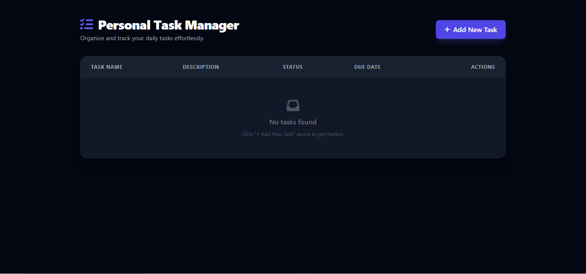
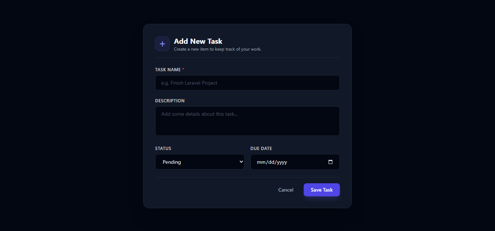
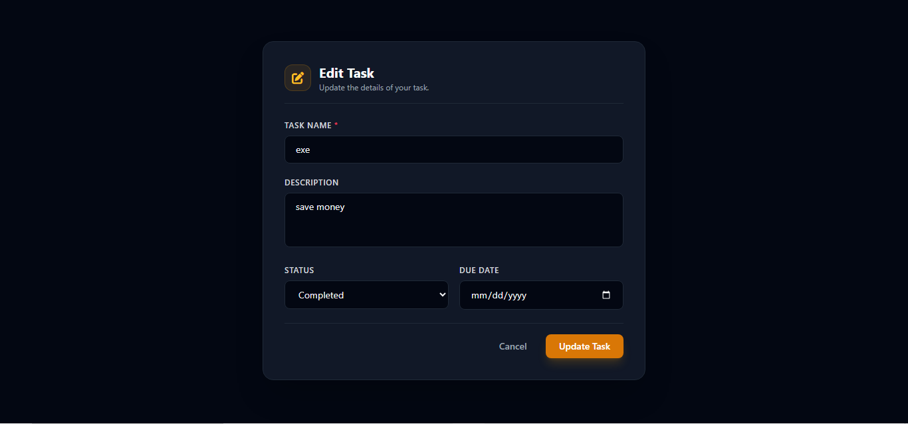
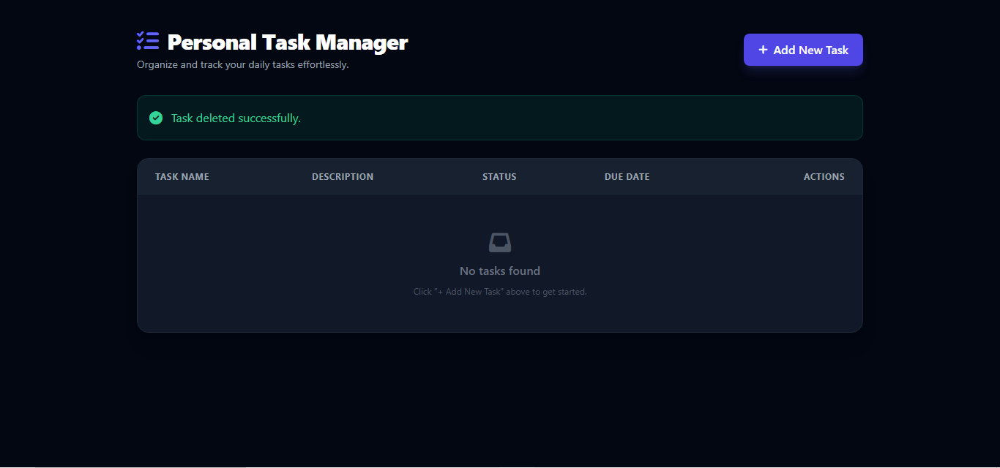

# Personal Task Manager

**Project Code:** WST21-PM-2026-SF
**Student Name:** Jaybert Sentillas
**Course & Year:** BSIT - 2nd Year
**Database Used:** SQLite

---

## 🚀 Features
- **Add Task:** Create new tasks with name, description, status, and due date.
- **View Tasks:** Clean dashboard interface displaying all saved tasks.
- **Edit Task:** Update task details dynamically.
- **Delete Task:** Remove completed or unwanted tasks.
- **Update Status:** Change task state between Pending and Completed.

---

## 📸 Application Screenshots

### Main Dashboard (Empty State)


### Add New Task Form


### Edit Task Form


### Task Deleted Notification


---

## 🛠️ Tech Stack
- **Framework:** Laravel 11
- **Frontend:** Blade Templates, Tailwind CSS (CDN), FontAwesome
- **Database:** SQLite
- **Environment:** GitHub Codespaces / PHP Artisan Serve

---

## 📌 Setup & Installation
1. Clone the repository:
   ```bash
   git clone [https://github.com/jaybertsentillas-max/Personal-Task-Manager.git](https://github.com/jaybertsentillas-max/Personal-Task-Manager.git)